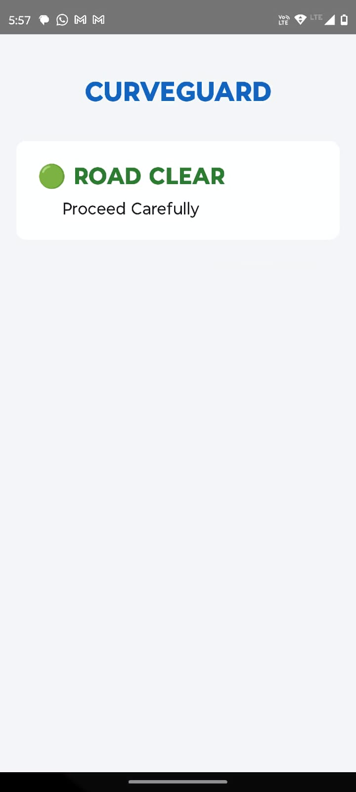
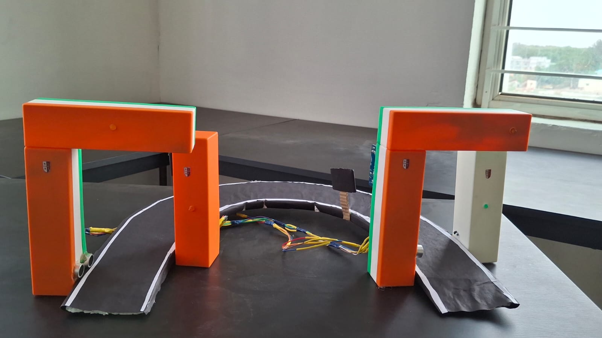

# 🚧 CurveGuard – Smart Blind Turn Alert System

> **An Intelligent IoT-Based Road Safety System for Blind Curves and Ghat Roads**


---

## 📖 Overview

CurveGuard is an intelligent road safety system designed to reduce accidents at blind turns, mountain roads, and ghat sections where drivers have limited visibility.

The system consists of two smart roadside units communicating through **LoRa**, combined with an Android application that provides **real-time notifications**, **voice alerts**, and **live road status** to approaching drivers.

Unlike conventional warning signs that rely only on visual indication, CurveGuard introduces **digital communication**, allowing drivers to receive alerts directly on their smartphones—even during adverse weather conditions where LED displays may become difficult to see.

---

# 🚨 Problem Statement

Blind curves are one of the major causes of road accidents because drivers cannot see vehicles approaching from the opposite direction.

Traditional convex mirrors and warning boards have several limitations:

- Poor visibility during heavy rain or fog
- Limited effectiveness at night
- No real-time vehicle information
- Passive warning mechanism
- No digital notification system

CurveGuard addresses these limitations by combining IoT communication with mobile notifications.

---

# 💡 Proposed Solution

Two intelligent roadside poles are installed on opposite sides of a blind curve.

When a vehicle approaches one side:

- The ToF sensor detects the vehicle.
- ESP32 processes the event.
- LoRa transmits the warning to the opposite pole.
- LED Matrix displays the warning.
- Buzzer alerts nearby drivers.
- Wi-Fi server broadcasts the road status.
- Android application receives the update.
- Driver receives:
  - Push Notification
  - Voice Alert
  - Live Dashboard Warning

---

# 🏗 System Architecture

```
                 Vehicle
                    │
                    ▼
          VL53L1X ToF Sensor
                    │
                    ▼
             ESP32-S3 CAM
                    │
           LoRa Communication
                    │
         -----------------------
                    │
             ESP32-S3 CAM
                    │
      ┌─────────────┴─────────────┐
      │                           │
      ▼                           ▼
 LED Matrix Display          Buzzer Alert
      │                           │
      └─────────────┬─────────────┘
                    │
             Wi-Fi Access Point
                    │
             Android Application
                    │
      Notification + Voice Alert
```

---

# ⭐ Key Features

- Real-Time Vehicle Detection
- LoRa Long Range Communication
- Android Notification System
- Voice Alert System
- Live Dashboard
- Weather Independent Digital Alert
- Low Power Design
- Modular Architecture
- Expandable for AI Integration
- Offline Operation
- Fast Response Time

---

# 📱 Android Application

The Android application provides:

- Live Road Status
- Real-Time Warning Screen
- Push Notifications
- Voice Alerts
- Connection Status
- Emergency Warning Interface

<p align="center">
  
  &nbsp;&nbsp;&nbsp;&nbsp;
  
</p>

The application is designed using **Jetpack Compose** for a modern Android UI.

---

# 🔧 Hardware Components

| Component | Quantity |
|------------|----------|
| ESP32-S3 CAM | 2 |
| RA-02 LoRa Module | 2 |
| VL53L1X ToF Sensor | 2 |
| MAX7219 LED Matrix | 1 |
| Active Buzzer | 1 |
| OLED Display | Optional |
| Battery Pack | Optional |

---

# 💻 Software Stack

## Embedded

- Arduino IDE
- ESP32 Framework
- SPI Communication
- I2C Communication
- LoRa Library

## Mobile

- Android Studio
- Kotlin
- Jetpack Compose
- Android Notification Manager
- Text To Speech

---

# 📡 Communication Flow

```
Vehicle Detected
       │
       ▼
VL53L1X Sensor
       │
       ▼
ESP32 Processing
       │
       ▼
LoRa Transmission
       │
       ▼
Receiving ESP32
       │
       ▼
LED + Buzzer
       │
       ▼
Wi-Fi Status Broadcast
       │
       ▼
Android Application
       │
       ▼
Notification + Voice Alert
```

---

# 📊 Advantages

- Improves driver awareness
- Reduces blind-turn accidents
- Low-cost implementation
- Low power consumption
- Long communication range
- Works without internet
- Suitable for rural roads
- Easily scalable
- Easy maintenance

---

# 🚀 Future Enhancements

- AI Vehicle Detection using ESP32 Camera
- Vehicle Classification
- Number Plate Recognition
- Cloud Dashboard
- Accident Analytics
- GPS Integration
- Emergency Vehicle Priority
- Solar Powered Operation
- Traffic Density Analysis

---

# 📂 Project Structure

```
CurveGuard/
│
├── AndroidApp/
│   ├── MainActivity.kt
│   ├── NotificationHelper.kt
│   ├── VoiceHelper.kt
│   └── UI/
│
├── ESP32/
│   ├── PoleA/
│   ├── PoleB/
│   └── Shared/
│
├── CircuitDiagram/
│
├── Images/
│
├── Documentation/
│
└── README.md
```

---

# 📸 Demonstration

Project Demonstration

- Vehicle approaches blind curve
- Detection through ToF sensor
- LoRa communication established
- Opposite pole receives warning
- LED Matrix displays warning
- Android notification appears
- Voice alert warns driver

---

# 🔒 Safety Considerations

- Low Voltage Design
- Wireless Communication
- No Internet Dependency
- Local Processing
- Fail-safe Operation

---

# 📈 Current Project Status

| Module | Status |
|---------|---------|
| Android Dashboard | ✅ Completed |
| Notification System | ✅ Completed |
| Voice Alert | ✅ Completed |
| LoRa Communication | ✅ Completed |
| Vehicle Detection | ✅ Completed |
| LED Warning | ✅ Completed |
| Hardware Prototype | ✅ Completed |

---

# 👨‍💻 Developed By

**Team Innovators**

Department of Electronics and Communication Engineering

---

# 📄 License

This project is developed for educational and research purposes.

---

# 🖼️ Product Image

<p align="center">
  
</p>

---

## ⭐ If you found this project interesting, consider giving it a Star.